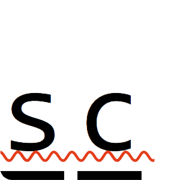

<a name="readme-top"></a>

<!-- PROJECT LOGO -->
<br />
<div align="center">
  <a href="https://github.com/haemie/spellcheck">
    
  </a>

  <h3 align="center">spellcheck</h3>
</div>

<!-- ABOUT THE PROJECT -->

## About The Project

Spelling bee game. Obscure words and definitions are currently generated by https://randomword.com/. Pronounciations and extra definitions are provided when available by https://dictionaryapi.com/.

<p align="right">(<a href="#readme-top">back to top</a>)</p>

### Frontend Built With

- React
- Vite
- HTMX (WIP)

- ### Backend Built With

- Express
- PostgreSQL

<p align="right">(<a href="#readme-top">back to top</a>)</p>

<!-- GETTING STARTED -->

## Getting Started

To get a local copy up and running follow these example steps.

### Prerequisites

- node
- npm

### Installation

1. Clone the repo
   ```sh
   git clone https://github.com/haemie/supertictactoe.git
   ```
2. Install NPM packages

   ```sh
   npm install
   ```

3. Install client packages
   ```sh
   cd client
   npm install
   ```
4. Install server packages
   ```sh
   cd ../server
   npm install
   ```

<!-- ROADMAP -->

## Roadmap

- [ ] learn how to ssl certify backend server because github pages enforces https
- [ ] [more regularly updated todo list](todo.md)

<p align="right">(<a href="#readme-top">back to top</a>)</p>
